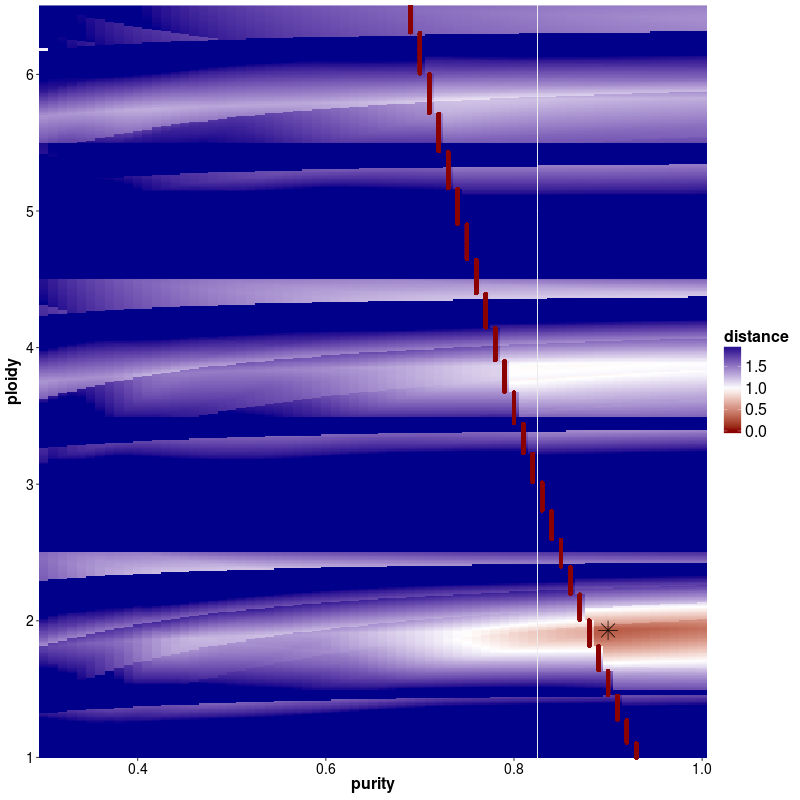
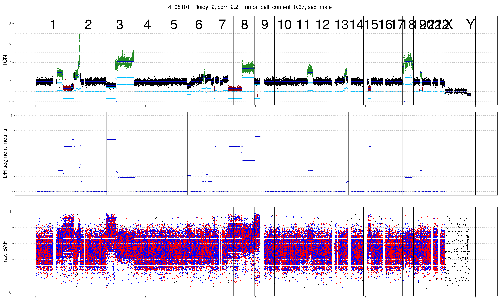
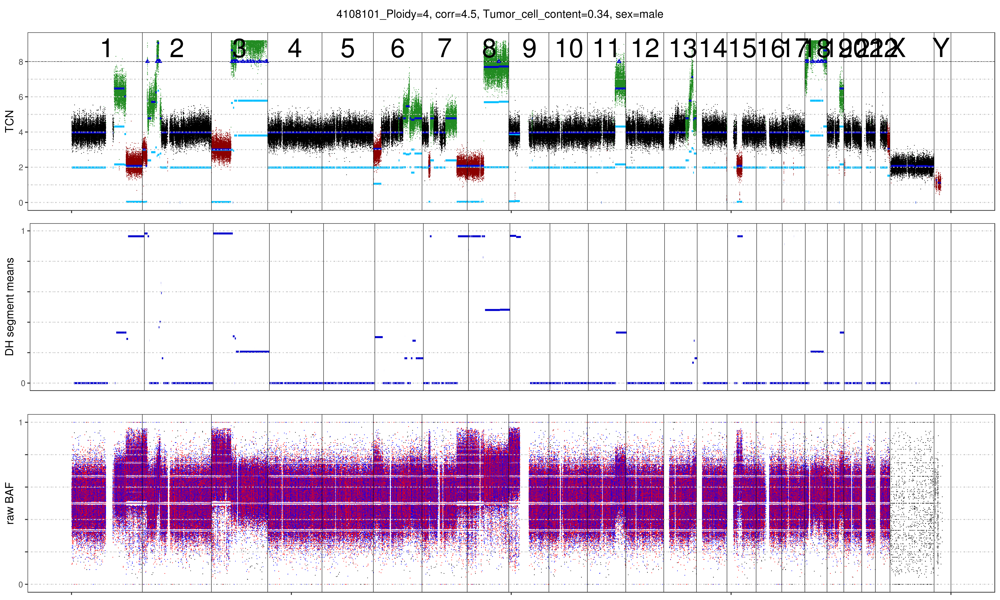

Purity Evaluation
=====================

Depending on the sample, ACEseq might return multiple possible solutions. These solutions can be found in the file ${PatientID}_ploidy_purity_2D.txt within the ACEseq results directory.

In addition to the table the plot ${PatientID}_tcn_distance_start.png shows a distance matrix.
This distance matrix indicates the estimated mean distance per ploidy/tcc combination based on the equations explained in the methods section. 
The optimally found minima are indicated by a star.

In case of multiple solutions, one can choose between the solution with the lowest distance or do as we suggest and choose the solution that is closest to diplot. 
It is recommended to make use of the prior knowledge about tumor biology as well as checking the final output as well as the mutant-allele frequency of a patient.

.. image:: images/4108101_tcn_distances_combined_star.png
   :scale: 40 %
   :align: center

As can be seen below the benefit of increasing the ploidy of this sample to tetraploid leads to a clonal fit of multiple segments though many others remain subclonal (indicated by deviation from integer copy number states).
This is often observed for heterogenous samples such as this shown lymphoma sample. Lymphoma tend to be diploid and heterogenous indicating that the diploid solution is correct. 
In addition we plotted the MAF distribution over balanced segments, that supports our assumption.  
Diploid solution:

Tetraploid solution:

MAF distribution over balanced segments:

.. image:: images/4108101_MAFplot_balanced.pdf
   :align: center

