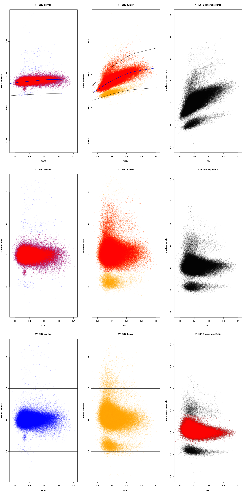
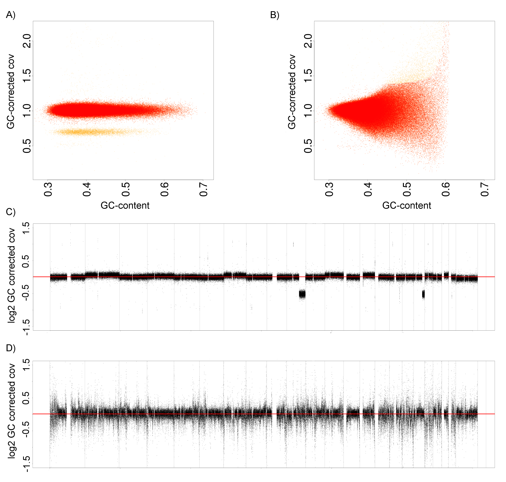

Quality check
=====================

ACEseq provides a thorough quality check of the sample by investigation of the GC-bias:
1.differences in GC-bias between tumor and control
2.evenness of coverage in tumor and control

The following plot shows the raw GC bias for a healthy control (left), a corresponding tumor (middle) and the tumor/control ratio (right). The top row depicts raw data while the middle row indicates GC-bias corrected data and the bottom line indicates GC-bias and RT-bias corrected data.

The file ${pid}_qc_gc_corrected.json provides information about slope, curvature and their differences between tumor and control. A strong diffrence between tumor and control can impact sensitivity and specificty of other variant calls.

The full width half maximum (FWHM) indicates the noise level within the majority copy number state in a sample. If it exceeds 0.205 in the control or 0.34 in the tumor a sample should be flagged with a warning. Yellow flagged tumors might have decreased specificity and sensitiviy. Samples should be red flagged in case the FWHM exceed 0.29 in healthy controls of 0.54 in tumors. Red flagged tumor samples are very likely to accumulate artifacts due to a noisy coverage profile and should be excluded from further analysis 
Flagged controls can be rescued by rerunning the pipeline with "rerunWithFakeControl=true". 
The following plot shows a sample with low FWHM (A and C) and a sample with noisy coverage and thus high FWHM (B and D). No good copy number estimates can be obtained from the high FWHM sample. 

